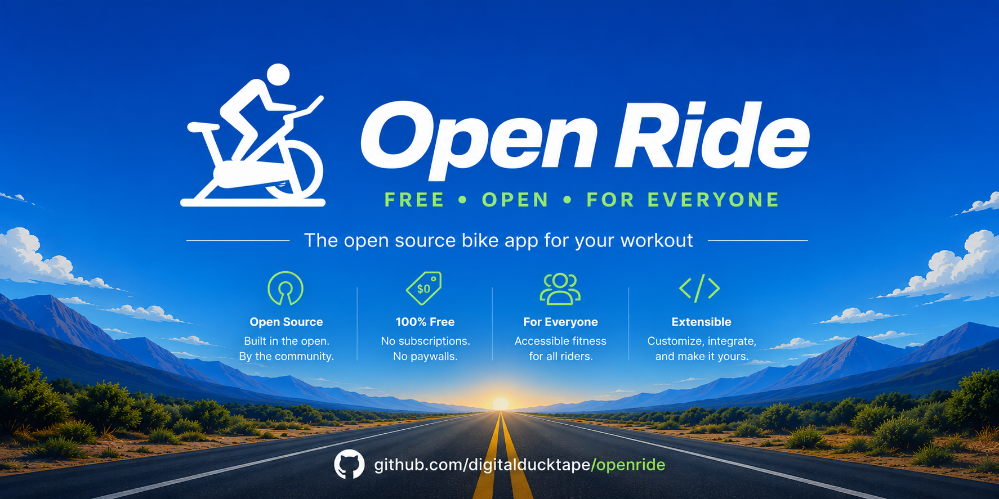
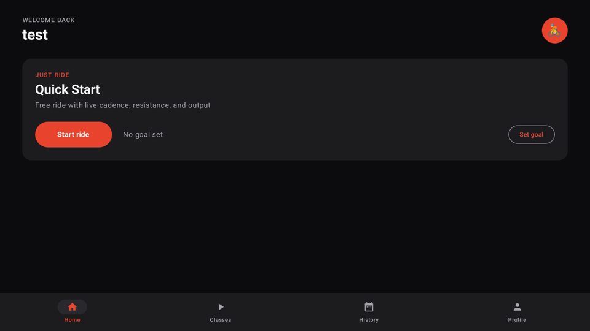
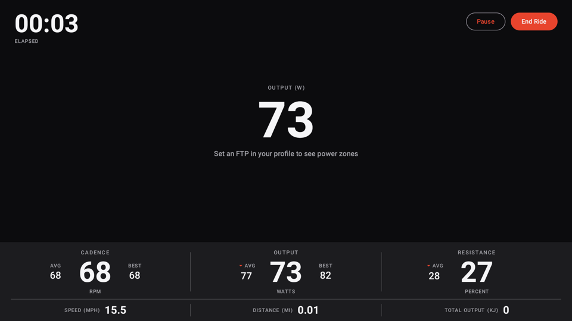
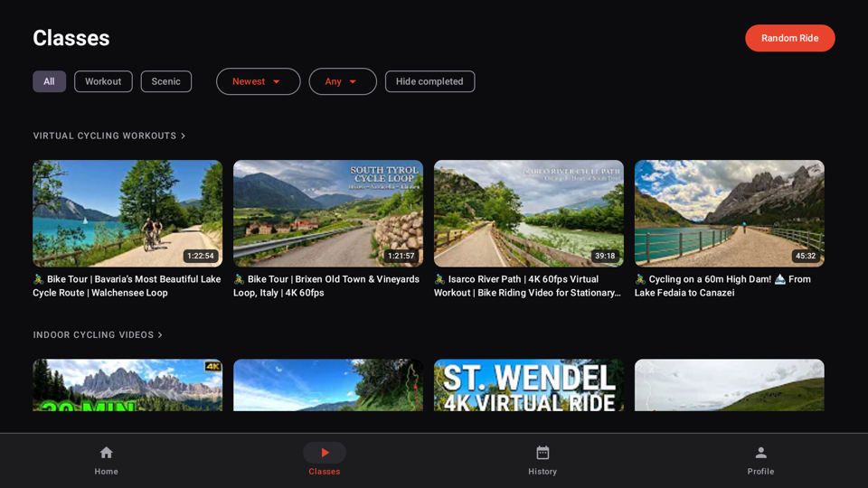
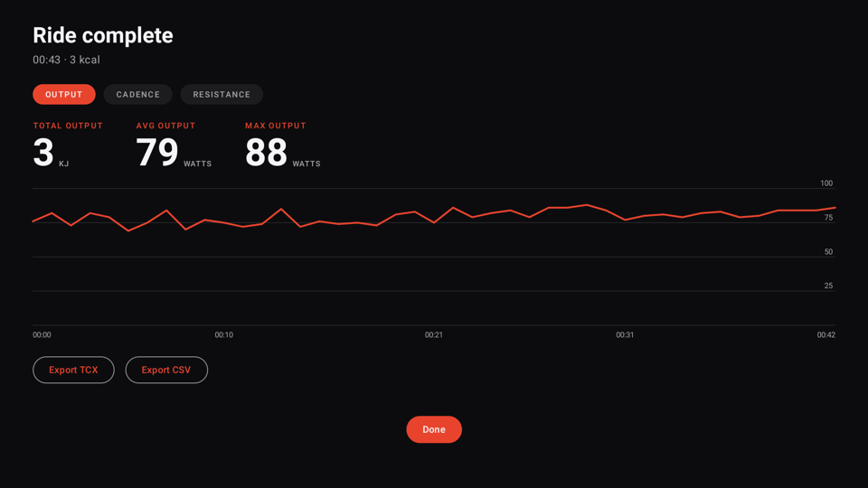
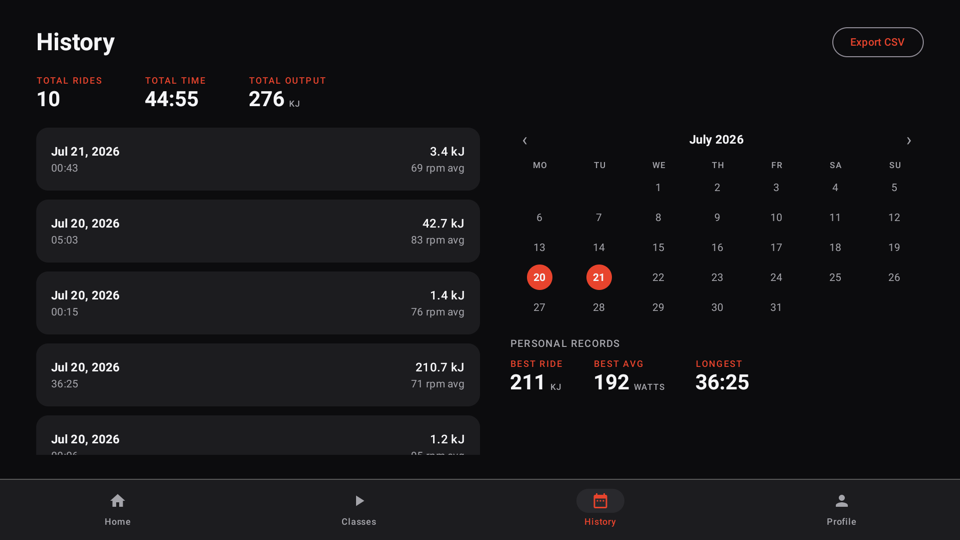
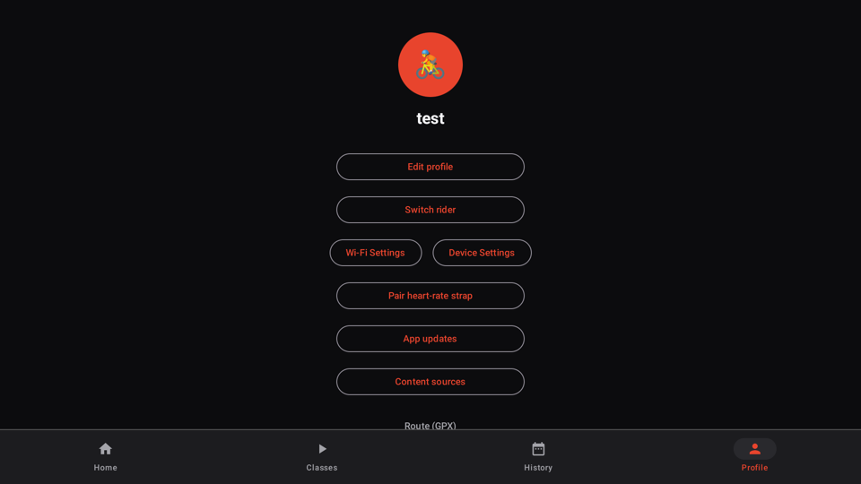

# OpenRide

<p align="center">
  
</p>

OpenRide is a free, independent workout app for the Peloton Bike (Gen 2). It replaces the screen you normally see when you turn on the bike with a similar-feeling experience — live stats while you ride, a library of free cycling videos, and a history of all your past rides — without needing a Peloton subscription.

It's installed using a free tool called [OpenPelo](https://github.com/doudar/Openpelo), which lets you add apps to the bike's tablet. This doesn't require rooting the device or unlocking anything permanently.

<p align="center">
  
  
  
</p>

## What it does

- **Live stats while you ride** — cadence, resistance, power, and speed, pulled straight from the bike itself, with no subscription required
- **A profile for everyone in the house** — each rider gets their own name, picture, and workout history
- **A library of free classes** — a constantly-updating selection of cycling videos pulled in automatically, so there's always something new to ride to
- **Ride history and personal bests** — a calendar of every past ride, plus your all-time best output, cadence, and duration
- **Export your ride data** — download any ride as a file (FIT, TCX, or CSV) to keep or use elsewhere, so your data is always yours
- **Heart-rate strap and Bluetooth headphone support** — pair a heart-rate monitor, and headphone audio just works once paired

<p align="center">
  
  
  
</p>

## Getting the app

OpenRide isn't available in an app store — you install it onto the bike's tablet yourself, either by downloading a ready-built APK from GitHub or by building it from this repo. This does take a little technical setup, but the steps below walk through everything.

### What you'll need

- A Peloton Bike (Gen 2), with [OpenPelo](https://github.com/doudar/Openpelo) already set up on it. OpenPelo is what gives your computer the ability to talk to the bike's tablet — set that up first, following its own instructions.
- A computer with `adb` installed (this is Android's device-connection tool, part of the free "Android SDK platform-tools" download).

### Step 1: Get the APK

**Option A — download it (recommended):** grab the latest `openride-real-*.apk` from the [Releases page](https://github.com/digitalducktape/openride/releases/latest) and save it somewhere on your computer.

**Option B — build it yourself:** if you'd rather build from source, you'll also need Java 21 and a copy of this repo (`git clone`, or download it as a ZIP from GitHub and unzip it). Then, in a terminal opened to that folder:

```sh
./gradlew :app:assembleDebugReal
```

This compiles OpenRide into an installable file at `app/build/outputs/apk/debugReal/app-debugReal.apk`.

### Step 2: Install it on the bike

Connect to the bike's tablet with `adb` (per OpenPelo's instructions), then run (substituting whichever APK path you ended up with above):

```sh
adb install -r app-debugReal.apk
adb shell am start -n dev.digitalducktape.openride.real/dev.digitalducktape.openride.MainActivity
```

The app should open to a profile selection screen — you're in.

From here, making OpenRide the screen that greets you when the bike turns on, and making sure a software update doesn't undo any of this, are covered step-by-step in **[docs/INSTALL.md](docs/INSTALL.md)**. Please read it in full before going further — the order of steps there matters.

### Staying up to date

Once it's installed, OpenRide checks this repo's [Releases](https://github.com/digitalducktape/openride/releases) on its own each time it launches, and shows a banner on the Home screen when a newer build is available — tap it (or go to **Profile → App updates**) to download and install, no `adb` required. See [docs/INSTALL.md](docs/INSTALL.md#in-app-updates-t22--22) for details.

## For developers

The rest of this section is technical detail for anyone contributing to the code — feel free to skip it otherwise.

- Kotlin + Jetpack Compose, single-activity, `minSdk 30` (the tablet's Android 11), package `dev.digitalducktape.openride`
- Sensor access sits behind a `BikeDataSource` abstraction with a `MockBikeDataSource` (simulated ride) so all UI/logic development runs in a standard emulator; only the real system-service binding needs the physical bike
- Room database: `Profile` / `Ride` / `RideSample` (per-second samples — required for FIT/TCX export)
- Content browser fetches per-channel YouTube RSS (`/feeds/videos.xml?channel_id=…`) on-device: no API key, no quota, no backend

## License

OpenRide is released under the [Apache License 2.0](LICENSE). Attributions for
prior community work and bundled dependencies are in
[THIRD_PARTY_NOTICES.md](THIRD_PARTY_NOTICES.md).

## Independent project — not affiliated with Peloton

OpenRide is an independent, non-commercial project. It is **not affiliated with,
authorized, sponsored, or endorsed by Peloton Interactive, Inc.** "Peloton" and
"Peloton Bike" are trademarks of their owner, used here only to describe the
hardware OpenRide runs on.

OpenRide ships **no Peloton source code, artwork, branding, audio, video, or
class content**. It reads the bike's own sensor values through an existing,
unprotected on-device service (no root, no firmware modification) purely for
interoperability, and streams third-party workout videos through YouTube's
official player. Any UI resemblance is limited to common layout and interaction
patterns. For the reverse-engineering and trademark basis, see
[docs/INTEROP.md](docs/INTEROP.md).
